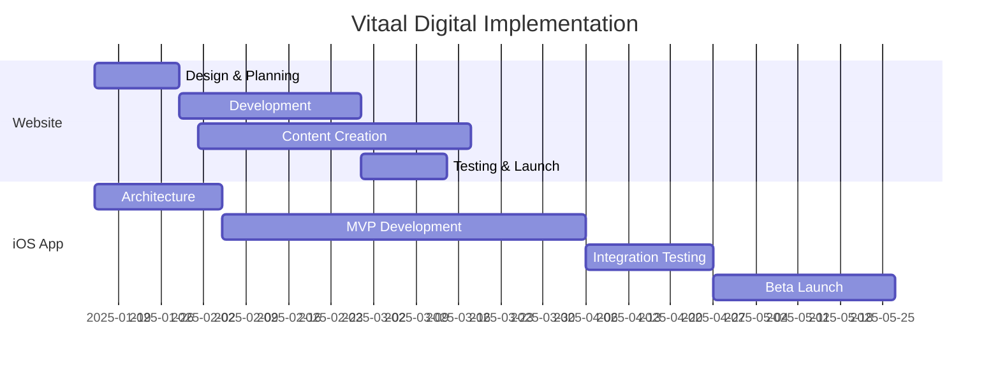

# Vitaal Digital Implementation Plan

## 🎯 Executive Summary

This document outlines the implementation plan for Vitaal's digital presence:
1. **Marketing Website** - Convert HNW prospects to €15,000-75,000/year members
2. **Vitaal Digital App** - iOS app for continuous patient care

## 📅 Timeline Overview

## 🌐 Website Implementation

### Phase 1: Foundation (Weeks 1-2)

**Design & Planning**
- [ ] Hire Danish web agency or freelancers
- [ ] Create brand guidelines document
- [ ] Design wireframes for all pages
- [ ] Set up Sanity CMS project
- [ ] Purchase vitaalklinic.dk domain

**Technical Setup**
- [ ] Initialize Next.js project
- [ ] Configure Vercel hosting
- [ ] Set up GitHub repository
- [ ] Install analytics tools
- [ ] Configure email automation

### Phase 2: Development (Weeks 3-6)

**Core Pages**
- [ ] Homepage with hero, services, testimonials
- [ ] Service pages (GLP-1, HBOT, Genetics, etc.)
- [ ] Membership/pricing page
- [ ] About us & team page
- [ ] Blog/resources section
- [ ] Contact & booking forms

**Key Features**
- [ ] Consultation booking system
- [ ] Membership calculator
- [ ] Newsletter signup
- [ ] Multi-language support (DA/EN)
- [ ] GDPR cookie consent

### Phase 3: Content & Launch (Weeks 7-8)

**Content Creation**
- [ ] Write all Danish copy
- [ ] Create/source photography
- [ ] Develop infographics
- [ ] Record introduction videos
- [ ] Write 10 initial blog posts

**Pre-Launch**
- [ ] SEO optimization
- [ ] Performance testing
- [ ] Cross-browser testing
- [ ] Legal/compliance review
- [ ] Soft launch to partners

## 📱 iOS App Implementation

### Phase 1: Architecture (Weeks 1-3)

**Planning**
- [ ] Hire iOS developer(s)
- [ ] Define API specifications
- [ ] Create UI/UX designs
- [ ] Set up AWS infrastructure
- [ ] Plan security architecture

**Development Environment**
- [ ] Configure Xcode project
- [ ] Set up CI/CD pipeline
- [ ] Create development certificates
- [ ] Configure TestFlight
- [ ] Set up crash reporting

### Phase 2: MVP Development (Weeks 4-12)

**Core Features**
- [ ] User authentication (Face ID)
- [ ] Health dashboard
- [ ] Lab results viewer
- [ ] Medication reminders
- [ ] Secure messaging
- [ ] HealthKit integration

**Backend Development**
- [ ] FHIR database setup
- [ ] API Gateway configuration
- [ ] Unilabs integration
- [ ] Push notification service
- [ ] Data encryption layer

### Phase 3: Testing & Launch (Weeks 13-16)

**Testing**
- [ ] Unit test coverage >80%
- [ ] UI automation tests
- [ ] Security penetration testing
- [ ] Performance optimization
- [ ] Beta user feedback

**Launch Preparation**
- [ ] App Store assets
- [ ] Privacy policy
- [ ] Support documentation
- [ ] Training materials
- [ ] Launch marketing

## 👥 Team Requirements

### Immediate Hires

**Website Team**
- UI/UX Designer (Danish market experience)
- Next.js Developer
- Content Writer (Native Danish)
- SEO Specialist

**App Team**
- Senior iOS Developer
- Backend Developer (AWS/FHIR)
- QA Engineer
- DevOps Engineer

### Budget Allocation

| Category | Website | iOS App | Total |
|----------|---------|---------|-------|
| Design | €15,000 | €20,000 | €35,000 |
| Development | €40,000 | €200,000 | €240,000 |
| Infrastructure | €5,000 | €30,000 | €35,000 |
| Marketing | €20,000 | €10,000 | €30,000 |
| **Total** | **€80,000** | **€260,000** | **€340,000** |

## 🔑 Critical Success Factors

### Website Success Metrics
- 10,000 unique visitors/month by Month 6
- 3% consultation booking conversion
- <3s page load time
- 90+ Lighthouse score

### App Success Metrics
- 80% daily active users
- 90% medication adherence
- <0.1% crash rate
- 70+ NPS score

## 🚨 Risk Mitigation

### Technical Risks
- **Integration delays**: Start Unilabs/GenomeScan discussions now
- **App Store rejection**: Follow guidelines strictly, no health claims
- **Performance issues**: Plan for load testing early
- **Security breaches**: Implement security-first architecture

### Business Risks
- **Low adoption**: Beta test with 100 founding members
- **Competition**: Fast execution to maintain first-mover advantage
- **Regulatory changes**: Stay engaged with authorities
- **Budget overrun**: Phase features, MVP first

## 📋 Weekly Milestones

### Week 1-2
- [ ] Post job listings for developers
- [ ] Create detailed technical specifications
- [ ] Set up project management tools
- [ ] Begin brand guideline development

### Week 3-4
- [ ] Conduct developer interviews
- [ ] Finalize website wireframes
- [ ] Start website development
- [ ] Create app UI mockups

### Week 5-6
- [ ] Complete homepage development
- [ ] Begin app architecture
- [ ] Write website copy
- [ ] Set up backend infrastructure

### Week 7-8
- [ ] Launch website beta
- [ ] Start app MVP coding
- [ ] Create content library
- [ ] Begin integration testing

## 🎯 Immediate Action Items

1. **This Week**
   - Post iOS developer job on LinkedIn/Jobindex
   - Contact 3 Danish web agencies for quotes
   - Schedule Unilabs API meeting
   - Register vitaalklinic.dk domain

2. **Next Week**
   - Interview developer candidates
   - Choose web agency/freelancer
   - Create Figma account for designs
   - Set up AWS account

3. **Within 2 Weeks**
   - Hire core development team
   - Finalize brand guidelines
   - Begin website development
   - Start API documentation

## 📞 Key Contacts

- **Project Lead**: Dr. Jesper Vang
- **Medical Advisor**: Dr. Peyman Pedrampour
- **Location**: Jagtvej 113, 1. sal, 2200 Copenhagen N

---

*Last Updated: January 2025*
