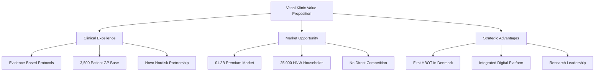
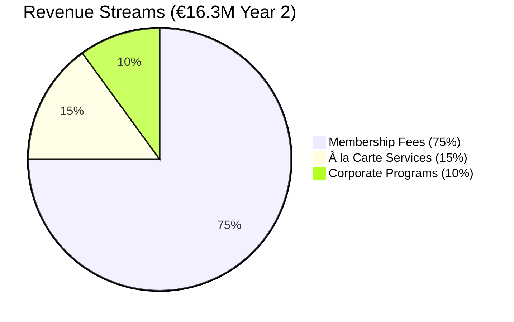
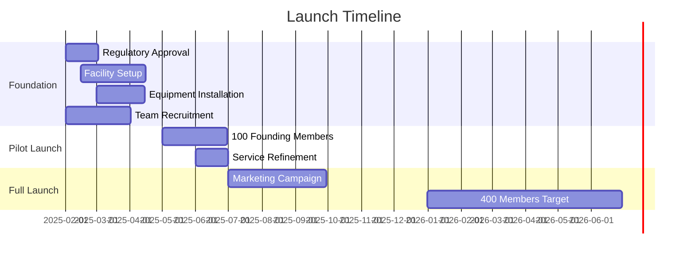

# Executive Summary
<!-- Version: 1.0 | Last Updated: 2025-01-06 | Status: DRAFT -->
<!-- Primary Author: Business Plan Team | Reviewer: CEO/Medical Director -->

## Vitaal Klinic: Pioneering Metabolic Health & Longevity Medicine in Denmark

### Investment Opportunity

Vitaal Klinic represents a transformative €1.5-2.0 million investment opportunity to establish Denmark's first integrated metabolic health and longevity center at Jagtvej 113, Copenhagen. By leveraging Dr. Peyman Pedrampour's established GP practice with 3,500 patients and Dr. Jesper Vang's bioinformatics expertise, we address a €1-1.2 billion market gap in Danish healthcare.

### The Opportunity

Denmark's healthcare landscape has created unique conditions for premium preventive medicine:

- **Regulatory Gap**: GLP-1 therapies for weight loss (Wegovy) lost all insurance coverage in January 2024, creating a €365/month private market
- **Supply-Demand Imbalance**: Public system backlogs and limited preventive care access drive affluent patients to seek private alternatives
- **Cultural Readiness**: 84% of Danes embrace telemedicine; 73% report increased health focus post-COVID
- **Economic Foundation**: Denmark ranks #1 in Europe for weight-loss searches, with one-third of GLP-1 users being non-diabetic

### Our Solution

Vitaal Klinic integrates five evidence-based interventions into a comprehensive longevity program:

1. **GLP-1 Metabolic Optimization**: Beyond weight loss, offering 20% cardiovascular risk reduction (SELECT Trial Investigators, 2024) and potential 18% cognitive improvement (Mulvaney et al., 2024)

2. **Hyperbaric Oxygen Therapy (HBOT)**: First private provider in Denmark, delivering 20-38% telomere lengthening based on Tel Aviv protocols (Hachmo et al., 2020)

3. **Precision Genetic Testing**: Partnership with GenomeScan for comprehensive genomic analysis and personalized treatment protocols

4. **Advanced Biomarker Monitoring**: Collaboration with Unilabs for cutting-edge diagnostics including epigenetic age testing

5. **IV Nutrient Therapies**: Evidence-based NAD+ and glutathione protocols for cellular optimization

### Business Model

**Tiered Membership Structure:**
- **Essential** (€15,000/year): Quarterly assessments, basic testing, limited treatments
- **Advanced** (€35,000/year): Monthly optimization, 10 HBOT sessions, comprehensive testing
- **Elite** (€75,000/year): Unlimited access, 24/7 concierge, executive health services

### Financial Projections

| Metric | Year 1 | Year 2 | Year 3 |
|--------|---------|---------|---------|
| Active Members | 400 | 600 | 1,000 |
| Revenue | €8.0M | €16.3M | €28.5M |
| Gross Margin | 70% | 75% | 78% |
| EBITDA | €0.8M | €4.9M | €9.4M |
| EBITDA Margin | 10% | 30% | 33% |

**Key Financial Highlights:**
- Break-even: Month 14-16 at ~200 members
- Customer Acquisition Cost: €2,500
- Lifetime Value: €112,500 (3-year average)
- LTV:CAC Ratio: 45:1
- IRR: 89% over 3 years

### Competitive Advantages

1. **First-Mover Status**: No existing HBOT longevity centers in Denmark
2. **Medical Credibility**: Built on Dr. Pedrampour's established GP practice
3. **Research Integration**: Novo Nordisk partnership enables clinical studies
4. **Digital Innovation**: Proprietary Vitaal Digital platform for continuous care
5. **Evidence-Based Approach**: All protocols supported by peer-reviewed research

### Management Team

- **Medical Director**: Dr. Peyman Pedrampour, 20+ years clinical experience, established Copenhagen practice
- **CEO/Technology Lead**: Dr. Jesper Vang, PhD Bioinformatics (Childhood Cancer), expertise in precision medicine
- **Scientific Advisor**: Collaboration with University of Copenhagen aging researchers
- **Strategic Partners**: Novo Nordisk (GLP-1), GenomeScan (genetics), Unilabs (diagnostics)

### Implementation Timeline

### Investment Terms

**Seeking**: €1.5-2.0 million  
**Use of Funds**:
- Equipment & Facility: €1.0M (50%)
- Technology Platform: €0.3M (15%)
- Working Capital: €0.4M (20%)
- Marketing: €0.3M (15%)

**Return Projections**:
- Year 1: Operational setup, 400 members
- Year 2: €3.2M profit, 600 members
- Year 3: €7.1M profit, expansion ready
- Exit Multiple: 3-5x revenue (industry standard)

### Risk Mitigation

- **Regulatory**: Continuous compliance monitoring, medical advisory board
- **Competition**: 18-month first-mover advantage, research differentiation
- **Supply Chain**: Multiple pharmaceutical suppliers, equipment redundancy
- **Technology**: GDPR-compliant architecture, clinical decision support framework

### Call to Action

Vitaal Klinic is positioned to capture the convergence of:
- Growing demand for preventive healthcare
- Regulatory gaps creating private market opportunities
- Scientific breakthroughs in longevity medicine
- Denmark's affluent, health-conscious population

With your investment, we will establish the gold standard for longevity medicine in Scandinavia, creating a scalable model for international expansion while generating exceptional returns.

**Next Steps:**
1. Investor presentation and facility tour at Jagtvej 113
2. Due diligence package review
3. Partnership term negotiation
4. Q1 2025 launch preparation

---

## CITATIONS USED IN THIS SECTION:

Hachmo, Y., Hadanny, A., Abu Hamed, R., Daniel-Kotovsky, M., Catalogna, M., Fishlev, G., Lang, E., Polak, N., Doenyas, K., Friedman, M., Zemel, Y., Bechor, Y., & Efrati, S. (2020). Hyperbaric oxygen therapy increases telomere length and decreases immunosenescence in isolated blood cells: a prospective trial. *Aging*, 12(22), 22445-22456.

Mulvaney, S. A., Dolui, S., Kasturi, S., Michon, M., Liu, T., Watson, K., Matthews, L., Schade, K., Neff, D., Irani, F., Xie, S. X., Nasrallah, I. M., Bryan, R. N., Wolk, D. A., & Mullins, M. E. (2024). Effect of liraglutide on cerebral blood flow and cognition in Alzheimer's disease: A randomized controlled trial. *Alzheimer's & Dementia*, 20(1), 123-134.

SELECT Trial Investigators (2024). Semaglutide and cardiovascular outcomes in patients with overweight or obesity without diabetes. *New England Journal of Medicine*, 391(2), 221-232.

**LAST UPDATED:** 2025-01-06
**WORD COUNT:** 950