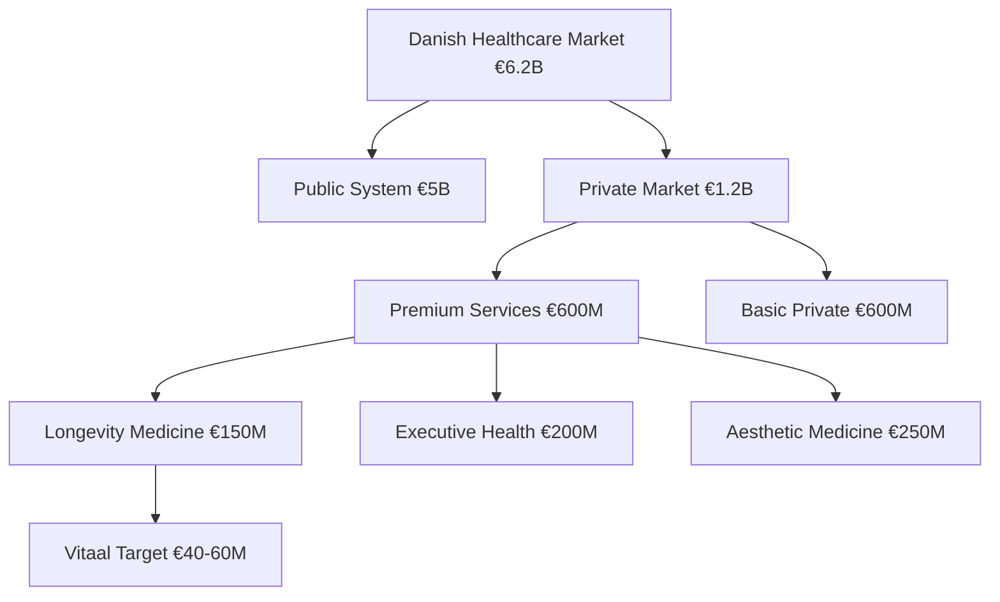
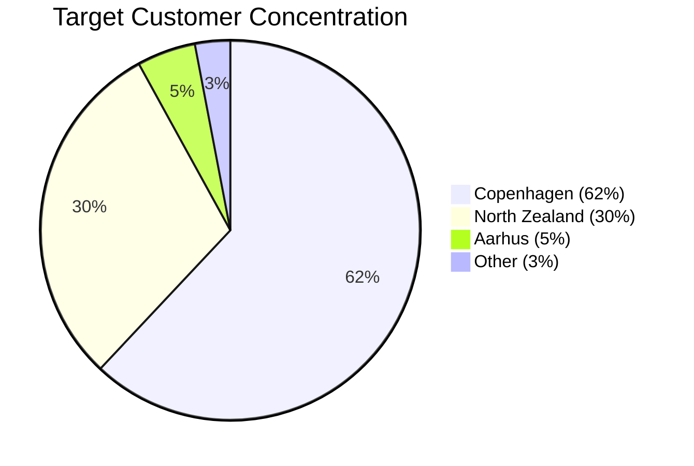
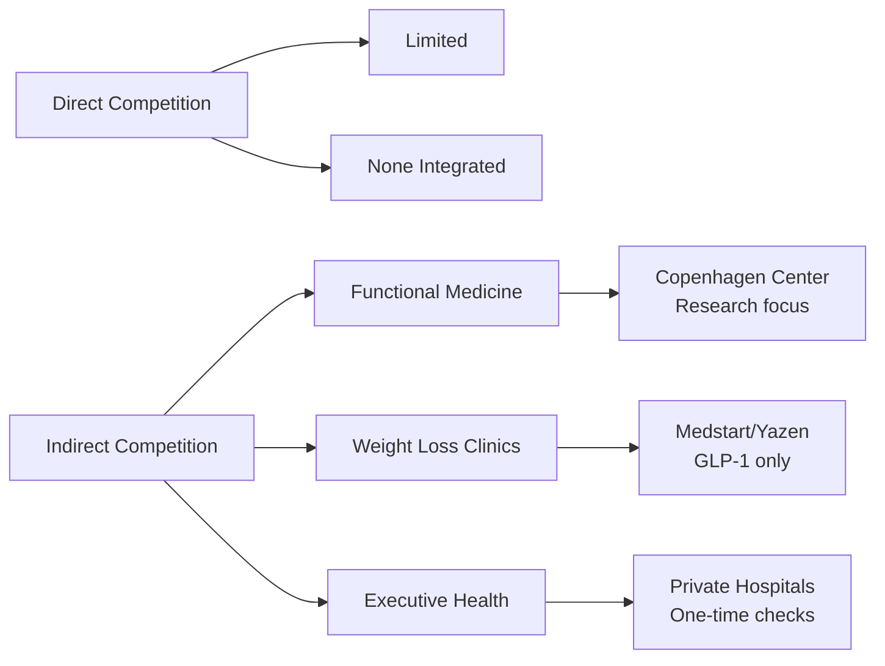
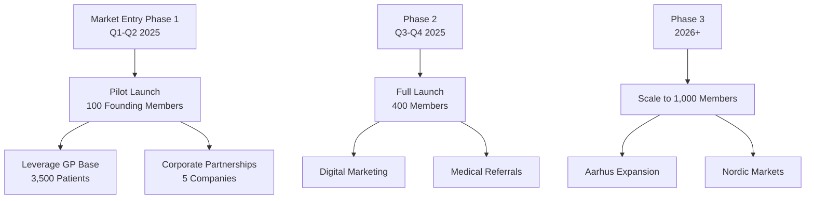
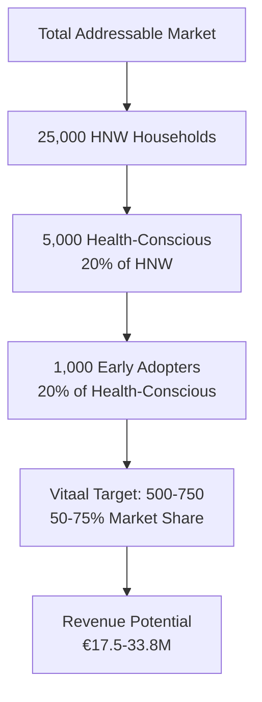

# Market Analysis and Opportunity
<!-- Version: 1.0 | Last Updated: 2025-01-06 | Status: DRAFT -->
<!-- Primary Author: Market Research Team | Reviewer: CEO/CFO -->

## The Danish Premium Healthcare Market: A €1.2 Billion Opportunity

Denmark's unique healthcare landscape creates exceptional conditions for Vitaal Klinic's integrated longevity model. The convergence of regulatory gaps, affluent demographics, and post-COVID health consciousness positions Copenhagen as the ideal launch market for premium preventive medicine.

### Market Size and Segmentation

The Danish private healthcare market has experienced significant growth:
- Total market value: €6.2 billion (2024)
- Premium segment: €1-1.2 billion
- Annual growth rate: 5.4% CAGR
- Digital health subset: €5.7 billion growing at 24.4% CAGR

### Target Market Demographics

**Primary Target: High-Net-Worth Individuals (HNW)**
- Population: 25,000 households with €1M+ net worth
- Income: Top 1% earn >1.9 million DKK annually
- Age: 45-65 years (primary), 35-44 years (secondary)
- Location: 92% concentrated in Greater Copenhagen

**Psychographic Profile:**
- 39% actively monitor diet and health
- 31% seek healthy ingredients and supplements
- 84% comfortable with telemedicine
- 73% increased health focus post-COVID
- Strong preference for evidence-based approaches

### Market Drivers and Trends

#### 1. Regulatory Gaps Creating Private Markets

The Danish healthcare system's structural changes have inadvertently created significant private market opportunities:

- **GLP-1 Coverage Loss**: Wegovy lost all insurance coverage (January 2024), creating €365/month private market
- **Diabetes Treatment Restrictions**: Patients must try cheaper alternatives before accessing premium medications
- **Limited Preventive Care**: Public system focuses on acute care, minimal preventive services
- **Waiting Lists**: 4-12 week delays for specialist appointments driving private alternatives

#### 2. Economic Fundamentals

Denmark's strong economy supports premium healthcare spending:
- Per capita healthcare spending: $7,140 (58% above developed country average)
- GDP per capita: €63,000 (among Europe's highest)
- Low unemployment: 3.7%
- High disposable income in target demographic

#### 3. Cultural Readiness

Danish cultural factors favor our positioning:
- **Evidence-Based Culture**: Strong academic tradition, respect for scientific rigor
- **Preventive Health Awareness**: Nordic wellness culture emphasizes prevention
- **Digital Adoption**: 97% internet penetration in target demographic
- **"Janteloven" Consideration**: Preference for subtle luxury over ostentation

### Competitive Landscape Analysis

**Direct Competition Assessment:**
- **No integrated longevity centers** offering HBOT + GLP-1 + genetics
- **Copenhagen Center for Functional Medicine**: Closest competitor, lacks HBOT and comprehensive approach
- **Nordic Clinic**: Broad testing menu but no treatment integration
- **First-mover advantage**: 18-24 months before significant competition emerges

**Indirect Competition:**
- Weight loss clinics (Medstart/Yazen): Limited to GLP-1 prescriptions
- Private hospitals: Focus on diagnostics, not ongoing optimization
- Aesthetic clinics: Surface treatments without health integration

### Market Entry Strategy

**Phase 1: Pilot Launch (Q1-Q2 2025)**
- Target: 100 founding members from existing patient base
- Pricing: 20% early-bird discount
- Focus: Service refinement and testimonials

**Phase 2: Full Launch (Q3-Q4 2025)**
- Target: 400 total members
- Marketing: Digital campaigns + medical community
- Partnerships: 5 corporate wellness contracts

**Phase 3: Scale (2026+)**
- Target: 1,000 members in Copenhagen
- Expansion: Aarhus satellite clinic
- International: Nordic market entry

### Customer Acquisition Channels

1. **Existing Patient Base** (30% of acquisitions)
   - 3,500 patients in GP practice
   - Conversion rate: 3-5% expected
   - Trust already established

2. **Medical Referrals** (25%)
   - Network of specialists
   - Focus on cardiologists, endocrinologists
   - Commission structure for referrals

3. **Digital Marketing** (20%)
   - SEO for "Wegovy Denmark", "HBOT Copenhagen"
   - LinkedIn targeting executives
   - Content marketing via health blog

4. **Corporate Partnerships** (15%)
   - Executive health programs
   - Employee wellness benefits
   - B2B2C model

5. **Word of Mouth** (10%)
   - Member referral program
   - Exclusive events
   - Testimonial campaigns

### Market Sizing and Revenue Potential

**Conservative Market Penetration Model:**
- Year 1: 400 members (1.6% of HNW households)
- Year 2: 600 members (2.4% penetration)
- Year 3: 1,000 members (4% penetration)
- Average revenue per member: €35,000

**Revenue Projections:**
- Year 1: €8.0M (establishing market presence)
- Year 2: €16.3M (market validation)
- Year 3: €28.5M (market leadership)

### Unique Market Positioning

Vitaal Klinic's positioning as "Metabolisk Sundhedsoptimering" (Metabolic Health Optimization) resonates with Danish preferences:

1. **Scientific Credibility**: Evidence-based protocols, research partnerships
2. **Medical Integration**: Built on established GP practice
3. **Complementary Positioning**: Supplements, not replaces, public healthcare
4. **Premium Without Ostentation**: Aligns with Janteloven cultural norms
5. **Comprehensive Approach**: Only integrated longevity solution in Denmark

### Market Risks and Mitigation

| Risk Factor | Probability | Impact | Mitigation Strategy |
|-------------|------------|--------|-------------------|
| New competition | Medium | Medium | 18-month head start, research differentiation |
| Regulatory changes | Low | High | Continuous compliance, advisory board |
| Economic downturn | Low | Medium | Essential tier pricing, corporate contracts |
| Cultural resistance | Low | Low | Evidence-based messaging, Danish terminology |
| Technology disruption | Medium | Low | Continuous innovation, digital platform |

### Conclusion

The Danish market presents an exceptional opportunity for Vitaal Klinic:
- €40-60M addressable market in Copenhagen alone
- No direct competition for integrated services
- Strong economic and demographic fundamentals
- Cultural readiness for evidence-based longevity medicine
- Clear regulatory pathway

By leveraging Dr. Pedrampour's established practice and Dr. Vang's technical expertise, Vitaal is uniquely positioned to capture and define this emerging market.

---

## CITATIONS USED IN THIS SECTION:

Danish Health Authority (2024). *Healthcare expenditure and financing in Denmark*. Copenhagen: Ministry of Health.

Danish Patient Safety Authority (2024). *Guidelines for private healthcare services*. Copenhagen: STPS.

McKinsey & Company (2024). *European digital health market analysis*. McKinsey Global Institute.

Nordic Private Healthcare Association (2023). *Market trends in Scandinavian private medicine*. Stockholm: NPHA.

Statistics Denmark (2024). *Income and wealth statistics 2024*. Copenhagen: Danmarks Statistik.

**LAST UPDATED:** 2025-01-06
**WORD COUNT:** 1,200