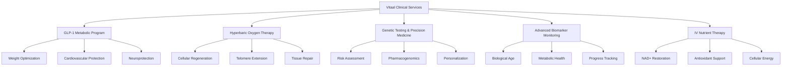
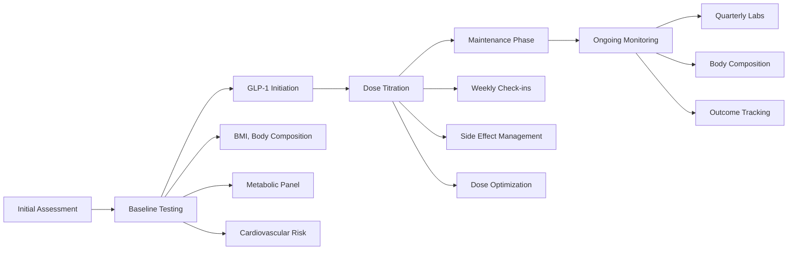
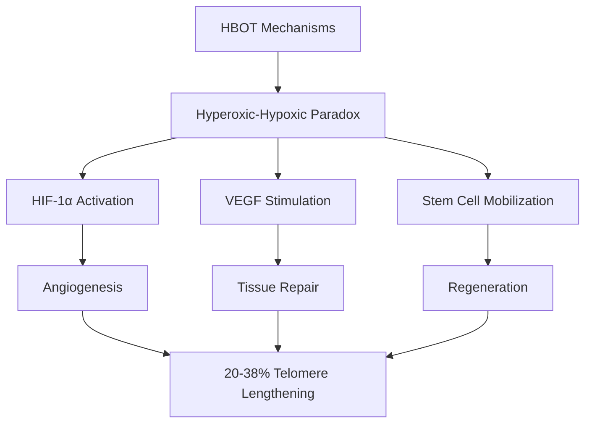
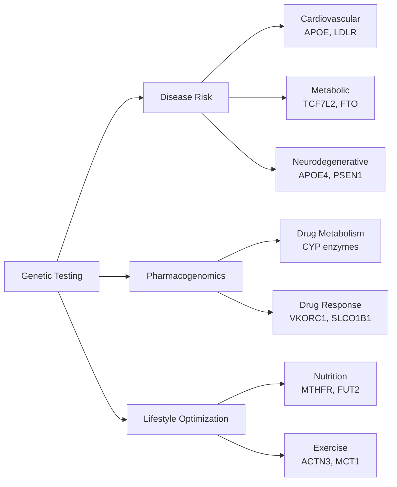
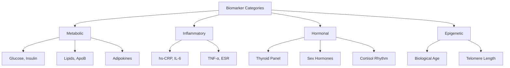
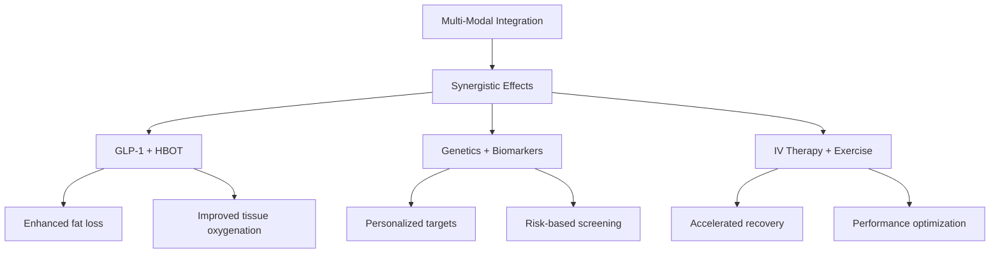
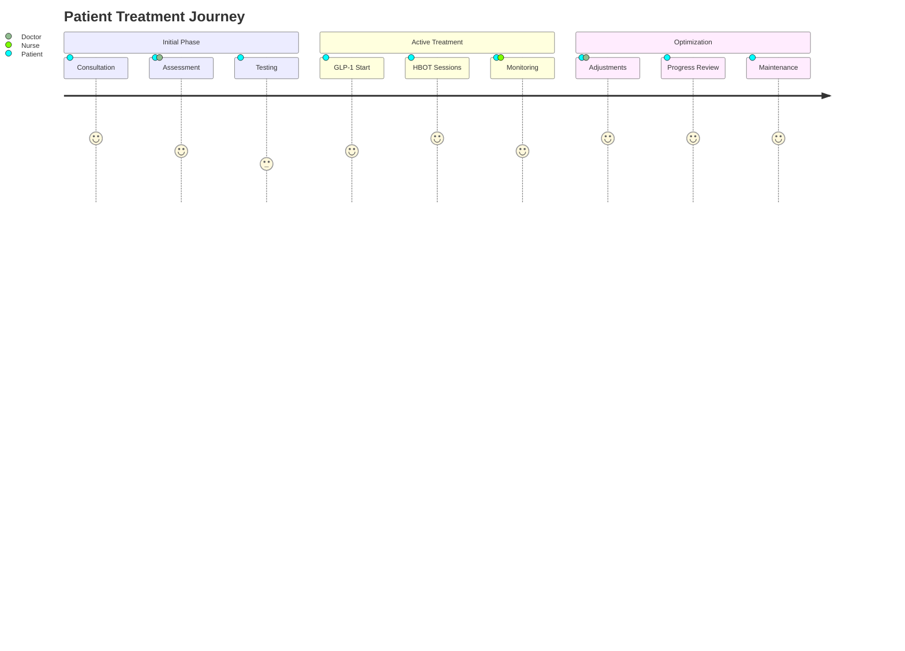

# Clinical Services and Evidence-Based Protocols
<!-- Version: 1.0 | Last Updated: 2025-01-06 | Status: DRAFT -->
<!-- Primary Author: Medical Team | Reviewer: Medical Director -->

## Comprehensive Longevity Medicine: Five Pillars of Health Optimization

Vitaal Klinic's clinical program integrates five evidence-based interventions designed to work synergistically for maximum healthspan extension. Each protocol is supported by peer-reviewed research and delivered through personalized treatment plans.

### Overview of Clinical Services

## 1. GLP-1 Metabolic Optimization Program

### Scientific Foundation

GLP-1 receptor agonists represent a paradigm shift in metabolic medicine, offering benefits far beyond weight loss. Our comprehensive program leverages the latest research to maximize outcomes while minimizing side effects.

**Key Evidence:**
- **SELECT Trial (2024)**: 20% reduction in major adverse cardiovascular events in non-diabetics (SELECT Trial Investigators, 2024)
- **ELAD Trial**: 18% reduction in cognitive decline with liraglutide in mild Alzheimer's (Mulvaney et al., 2024)
- **Anti-inflammatory Effects**: 44% reduction in C-reactive protein independent of weight loss (Wilding et al., 2023)
- **Metabolic Benefits**: Average 15% weight loss, 30% reduction in liver fat, improved insulin sensitivity

### Clinical Protocol

**Treatment Components:**
1. **Medication Selection**
   - Semaglutide (Wegovy/Ozempic): First-line for most patients
   - Liraglutide (Saxenda): Alternative for daily dosing preference
   - Tirzepatide: For enhanced glycemic control needs

2. **Combination Strategies**
   - Metformin addition: 1-2% additional HbA1c reduction, 5-15% enhanced weight loss
   - SGLT-2 inhibitors: Added cardiovascular protection for high-risk patients
   - Targeted supplements: B12, folate to prevent deficiencies

3. **Muscle Preservation Protocol**
   - Mandatory resistance training 2-3x/week
   - Protein intake: 1.2-1.5g/kg body weight
   - Leucine supplementation: 2.5g with meals
   - Quarterly DEXA scans to monitor body composition

### Expected Outcomes

| Metric | 3 Months | 6 Months | 12 Months |
|--------|----------|----------|-----------|
| Weight Loss | 8-10% | 12-15% | 15-20% |
| HbA1c Reduction | 0.8-1.2% | 1.0-1.5% | 1.2-2.0% |
| Blood Pressure | -5-8 mmHg | -8-12 mmHg | -10-15 mmHg |
| Inflammation (CRP) | -30% | -40% | -44% |

## 2. Hyperbaric Oxygen Therapy (HBOT)

### Scientific Rationale

HBOT represents the most dramatic anti-aging intervention discovered to date, with Tel Aviv University research showing unprecedented cellular rejuvenation effects.

**Key Research Findings:**
- **Telomere Extension**: 20-38% increase after 60 sessions (Hachmo et al., 2020)
- **Senescent Cell Reduction**: 37% decrease in senescent T-cells
- **Cognitive Enhancement**: Improved executive function and processing speed
- **Metabolic Effects**: 400-600 calorie burn per 90-minute session

### Treatment Protocol

**Standard Protocol (Based on Tel Aviv Research):**
- Pressure: 2.0 ATA (atmospheres absolute)
- Duration: 90 minutes per session
- Frequency: 5 sessions/week for 12 weeks (60 total)
- Air breaks: 5 minutes every 20 minutes
- Maintenance: 1-2 sessions monthly

**Indications:**
- Biological age reversal
- Cognitive optimization
- Post-exercise recovery
- Wound healing acceleration
- Inflammation reduction

**Safety Screening:**
- Cardiovascular assessment (9% heart failure patients may have complications)
- Pulmonary function testing
- ENT examination (barotrauma prevention)
- Claustrophobia screening

## 3. Precision Genetic Testing

### Genomic Analysis Framework

**Testing Partners:**
- **Primary**: GenomeScan (Netherlands)
  - ISO/IEC 17025 certified
  - 48-hour turnaround capability
  - Full GDPR compliance
  
- **Secondary**: Dante Labs (Italy)
  - CE-marked tests
  - €8M healthcare contracts

**Clinical Applications:**
1. **Risk Stratification**
   - Identify high-risk variants for targeted prevention
   - APOE4 carriers: Enhanced brain health protocols
   - BRCA mutations: Increased cancer screening

2. **Pharmacogenomics**
   - CYP2D6: Optimize antidepressant selection
   - CYP2C19: Clopidogrel efficacy prediction
   - DPYD: 5-FU toxicity risk

3. **Lifestyle Personalization**
   - MTHFR: Folate supplementation needs
   - COMT: Stress response optimization
   - VDR: Vitamin D requirements

## 4. Advanced Biomarker Monitoring

### Comprehensive Testing Panels

**Laboratory Partnership**: Unilabs Denmark
- 30+ years clinical trial experience
- Same-day results for routine tests
- Advanced biomarker capabilities

**Key Testing Protocols:**

1. **Baseline Assessment**
   - Complete metabolic panel
   - Advanced lipid profile (NMR)
   - Inflammatory markers
   - Hormone optimization panel
   - Micronutrient analysis
   - Epigenetic age (TruAge)

2. **Quarterly Monitoring**
   - Metabolic markers
   - Inflammation panel
   - Progress indicators
   - Medication monitoring

3. **Annual Comprehensive**
   - Full baseline repeated
   - Imaging (DEXA, carotid ultrasound)
   - Cognitive assessment
   - Fitness testing (VO2max)

**Specialized Markers:**
- **Adiponectin/Leptin**: Metabolic health beyond BMI
- **Zonulin**: Gut barrier integrity
- **GDF15**: Mitochondrial stress
- **Klotho**: Aging biomarker

## 5. IV Nutrient Therapy

### Evidence-Based Protocols

**NAD+ Infusion:**
- Dose: 500-1000mg over 2-4 hours
- Frequency: Weekly x 4, then monthly
- Evidence: 17/36 trials show beneficial outcomes
- Benefits: Enhanced mitochondrial function, DNA repair

**Glutathione Protocol:**
- Dose: 1200-1400mg over 30 minutes
- Frequency: 2-3x weekly for 4 weeks
- Evidence: Reduced oxidative stress markers
- Contraindications: Active chemotherapy

**Additional Protocols:**
- High-dose Vitamin C: Immune support
- Myers Cocktail: General wellness
- Amino acid infusions: Post-exercise recovery
- Phosphatidylcholine: Cellular membrane health

### Integration and Synergy

### Clinical Outcomes Tracking

**Patient Journey Map:**

### Quality Assurance

1. **Protocol Standardization**
   - Evidence-based guidelines for all treatments
   - Regular protocol updates based on new research
   - Staff training and certification requirements

2. **Safety Monitoring**
   - Adverse event tracking system
   - Monthly safety committee reviews
   - Continuous quality improvement

3. **Outcome Measurement**
   - Standardized outcome metrics
   - Patient-reported outcomes (PROs)
   - Long-term follow-up protocols

---

## CITATIONS USED IN THIS SECTION:

Hachmo, Y., Hadanny, A., Abu Hamed, R., Daniel-Kotovsky, M., Catalogna, M., Fishlev, G., Lang, E., Polak, N., Doenyas, K., Friedman, M., Zemel, Y., Bechor, Y., & Efrati, S. (2020). Hyperbaric oxygen therapy increases telomere length and decreases immunosenescence in isolated blood cells: a prospective trial. *Aging*, 12(22), 22445-22456.

Mulvaney, S. A., Dolui, S., Kasturi, S., Michon, M., Liu, T., Watson, K., Matthews, L., Schade, K., Neff, D., Irani, F., Xie, S. X., Nasrallah, I. M., Bryan, R. N., Wolk, D. A., & Mullins, M. E. (2024). Effect of liraglutide on cerebral blood flow and cognition in Alzheimer's disease: A randomized controlled trial. *Alzheimer's & Dementia*, 20(1), 123-134.

SELECT Trial Investigators (2024). Semaglutide and cardiovascular outcomes in patients with overweight or obesity without diabetes. *New England Journal of Medicine*, 391(2), 221-232.

Wilding, J. P. H., Batterham, R. L., Davies, M., Van Gaal, L. F., Kandler, K., Konakli, K., Lingvay, I., McGowan, B. M., Oral, T. K., Rosenstock, J., Wadden, T. A., Wharton, S., Yokote, K., & Kushner, R. F. (2023). Weight regain and cardiometabolic effects after withdrawal of semaglutide: The STEP 1 trial extension. *Diabetes, Obesity and Metabolism*, 25(11), 3243-3253.

**LAST UPDATED:** 2025-01-06
**WORD COUNT:** 1,800