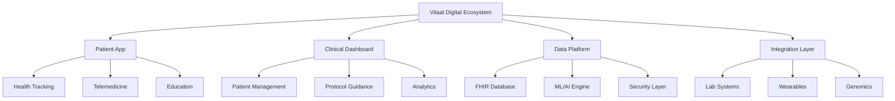
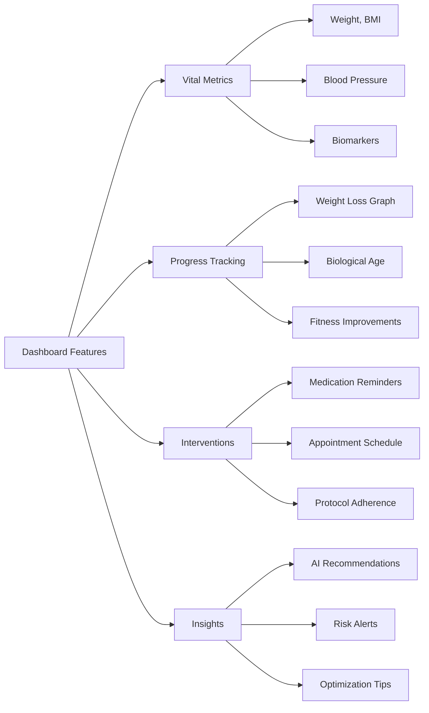
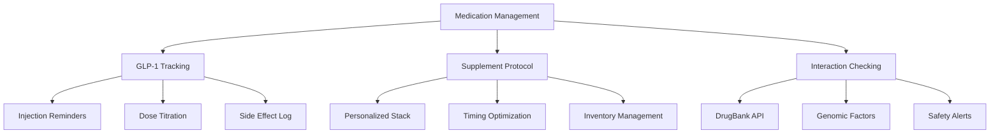
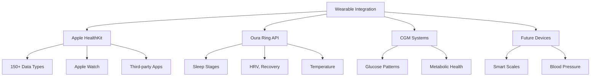
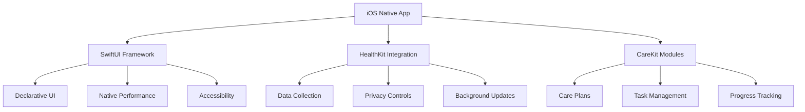
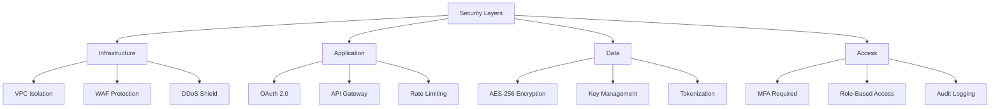
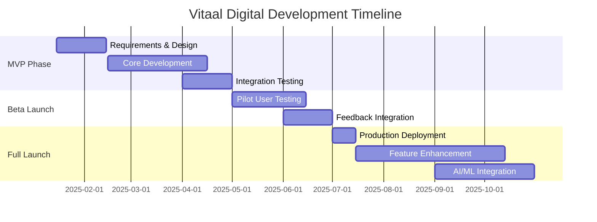
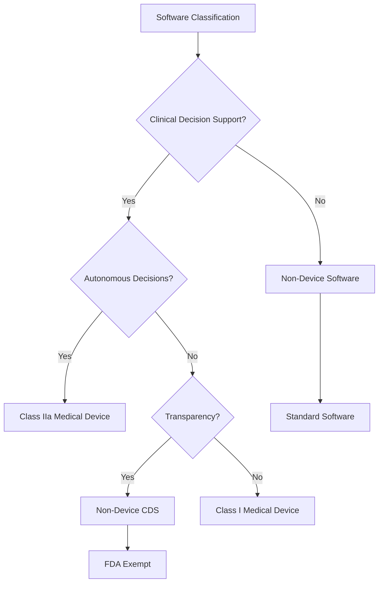
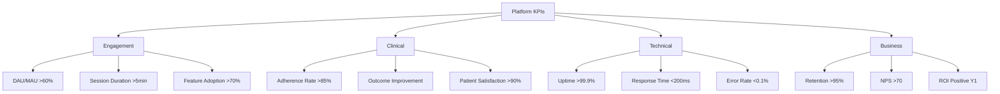

# Technology Platform: Vitaal Digital
<!-- Version: 1.0 | Last Updated: 2025-01-06 | Status: DRAFT -->
<!-- Primary Author: Technology Team | Reviewer: CTO/Medical Director -->

## Digital Innovation for Continuous Care and Personalized Medicine

Vitaal Digital represents a paradigm shift in longevity medicine delivery—transforming episodic clinical visits into continuous, data-driven health optimization. Built on cutting-edge iOS frameworks and FHIR-compliant architecture, our platform seamlessly integrates clinical care, real-time monitoring, and AI-powered insights.

### Platform Overview

## Core Functionalities

### 1. Personal Health Dashboard

The dashboard serves as the central hub for members' health journey, providing real-time insights and progress tracking.

**Key Features:**
- Real-time data visualization with interactive charts
- Biological age tracking using epigenetic markers
- Personalized health score algorithms
- Trend analysis with predictive modeling
- Goal setting and achievement tracking

### 2. Biomarker and Results Integration

Seamless integration with laboratory and genetic testing partners ensures all health data is centralized and actionable.

**Laboratory Integration:**
- Direct HL7/FHIR feed from Unilabs
- Automated result interpretation
- Historical trending analysis
- Reference range personalization
- Alert system for critical values

**Genetic Data Management:**
- Secure VCF file processing
- PharmCAT integration for pharmacogenomics
- Risk score calculations
- Actionable variant reporting
- Family history correlation

### 3. Medication Management System

**Advanced Features:**
- Smart injection reminders with confirmation
- Side effect tracking with severity scoring
- Automated refill coordination
- Drug-gene interaction warnings
- Compliance analytics and reporting

### 4. Telemedicine and Communication

Integrated telehealth capabilities ensure continuous access to the care team.

**Communication Channels:**
- Secure video consultations (WebRTC-based)
- Asynchronous messaging with care team
- AI-powered symptom checker
- Emergency contact protocols
- Group session capabilities

**Scheduling System:**
- Real-time availability display
- Automated appointment reminders
- Rescheduling flexibility
- Time zone management
- Integration with clinical calendars

### 5. Wearable Device Integration

**Data Collection:**
- Passive activity tracking (steps, calories, distance)
- Sleep quality metrics (duration, stages, efficiency)
- Heart rate variability for stress assessment
- Blood oxygen and respiratory rate
- Continuous glucose monitoring (when prescribed)

### 6. AI-Powered Insights Engine

Our proprietary algorithms analyze multimodal data to provide personalized recommendations.

**Machine Learning Applications:**
- Predictive risk modeling for chronic diseases
- Treatment response prediction
- Optimal intervention timing
- Side effect likelihood assessment
- Personalized goal recommendations

**Example Insights:**
- "Your sleep quality decreased 15% since starting GLP-1. Consider taking your dose earlier."
- "Based on your genetics and current markers, adding CoQ10 may improve your energy levels."
- "Your biological age improved by 2.3 years in the last quarter—keep up the great work!"

## Technical Architecture

### 1. Frontend Technology Stack

**iOS Development Strategy:**
- Native iOS app for optimal performance
- SwiftUI for modern, maintainable code
- HealthKit for seamless health data access
- CareKit for proven healthcare UI patterns
- Core ML for on-device AI inference

### 2. Backend Infrastructure

**Cloud Architecture:**
- AWS HealthLake for FHIR-compliant data storage
- Serverless computing for scalability
- Multi-region deployment for reliability
- Auto-scaling based on demand
- 99.9% uptime SLA

**Data Management:**
- FHIR R4 standard for all health records
- Event-driven architecture for real-time updates
- Data lake for analytics and ML training
- Automated backups with point-in-time recovery
- Disaster recovery with <4 hour RTO

### 3. Security and Compliance

**Compliance Framework:**
- GDPR-compliant by design
- ISO 27001 certification planned
- Danish health data regulations
- HIPAA-ready architecture
- Continuous compliance monitoring

### 4. Integration Architecture

**External Integrations:**
- **Unilabs**: HL7v2/FHIR for lab results
- **GenomeScan**: Secure API for genetic data
- **DrugBank**: Drug interaction database
- **Novo Nordisk**: Supply chain integration
- **Apple Health**: HealthKit framework

**Integration Patterns:**
- RESTful APIs with OAuth 2.0
- Webhook support for real-time updates
- Message queuing for reliability
- Circuit breaker patterns
- Comprehensive error handling

## Development Roadmap

### Phase 1: MVP (Q1 2025)
- Basic health dashboard
- Lab result display
- Medication reminders
- Secure messaging
- Apple HealthKit integration

### Phase 2: Beta (Q2 2025)
- Telemedicine capabilities
- Wearable integrations
- Enhanced analytics
- Care team dashboard
- Performance optimization

### Phase 3: Full Launch (Q3 2025)
- AI-powered insights
- Advanced visualizations
- Group session support
- Research module
- API marketplace

### Phase 4: Advanced Features (Q4 2025+)
- Predictive health modeling
- Digital twin simulations
- Blockchain health records
- International expansion
- White-label capabilities

## Regulatory Considerations

### Medical Device Classification

**Current Status:**
- Positioned as non-device Clinical Decision Support
- All recommendations require clinical review
- Transparent algorithm explanations
- No autonomous treatment decisions

**Future Considerations:**
- EU AI Act compliance (2026)
- Potential Class IIa certification for advanced features
- ISO 13485 quality management system
- Clinical validation studies

## User Experience Design

### Design Principles

1. **Clarity First**: Medical data presented simply
2. **Trust Through Transparency**: Show data sources
3. **Actionable Insights**: Every metric linked to actions
4. **Cultural Sensitivity**: Danish language and norms
5. **Accessibility**: WCAG 2.1 AA compliance

### Key Interfaces

**Dashboard View:**
- Personalized metric cards
- Progress rings for goals
- Alert badges for attention items
- Quick actions for common tasks

**Data Visualization:**
- Interactive charts with zoom/pan
- Comparative analysis tools
- Export capabilities for sharing
- Annotation features for events

**Communication Hub:**
- Unified inbox for all messages
- Video call integration
- File sharing for documents
- Translation support

## Success Metrics

## Competitive Advantages

1. **Native iOS Performance**: Superior to web-based competitors
2. **Deep Health Integration**: Leveraging Apple's health ecosystem
3. **Danish-First Design**: Localized for cultural preferences
4. **Research-Grade Data**: Academic partnership quality
5. **Continuous Innovation**: Quarterly feature releases

## Investment in Technology

| Category | Year 1 | Year 2 | Year 3 |
|----------|---------|---------|---------|
| Development | €200,000 | €150,000 | €200,000 |
| Infrastructure | €50,000 | €75,000 | €100,000 |
| Licenses | €30,000 | €40,000 | €50,000 |
| Security | €20,000 | €25,000 | €30,000 |
| **Total** | **€300,000** | **€290,000** | **€380,000** |

---

## CITATIONS USED IN THIS SECTION:

Apple Inc. (2024). *HealthKit Framework Documentation*. Cupertino: Apple Developer.

FHIR Community (2024). *Fast Healthcare Interoperability Resources (FHIR) R4*. HL7 International.

Danish Health Data Authority (2024). *National standards for health IT systems*. Copenhagen: Sundhedsdatastyrelsen.

European Commission (2023). *Artificial Intelligence Act - Healthcare Provisions*. Brussels: EC.

**LAST UPDATED:** 2025-01-06
**WORD COUNT:** 1,500