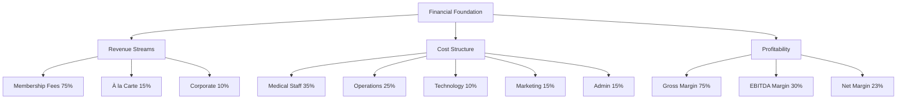
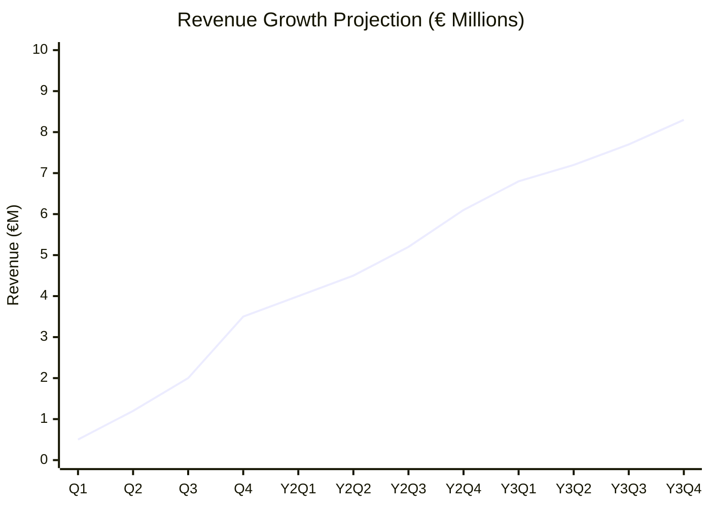
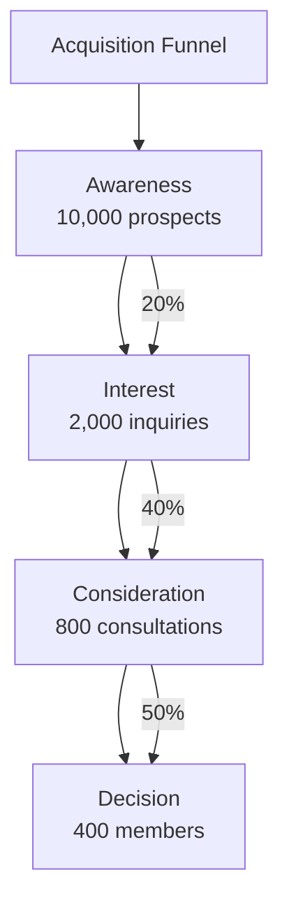
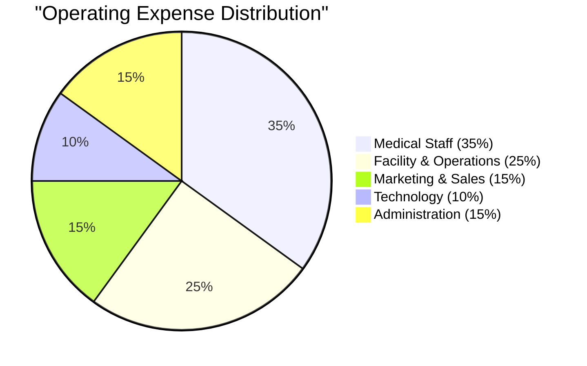
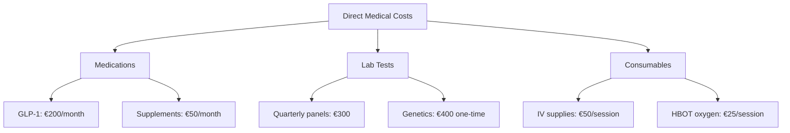
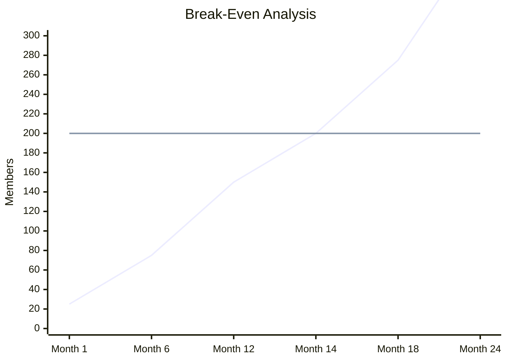
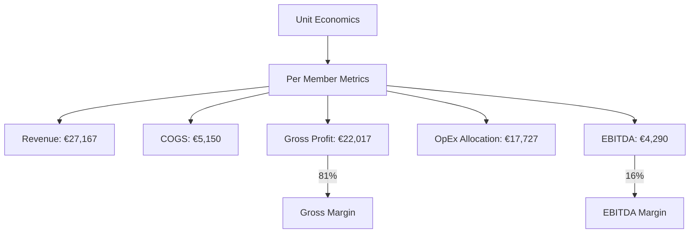
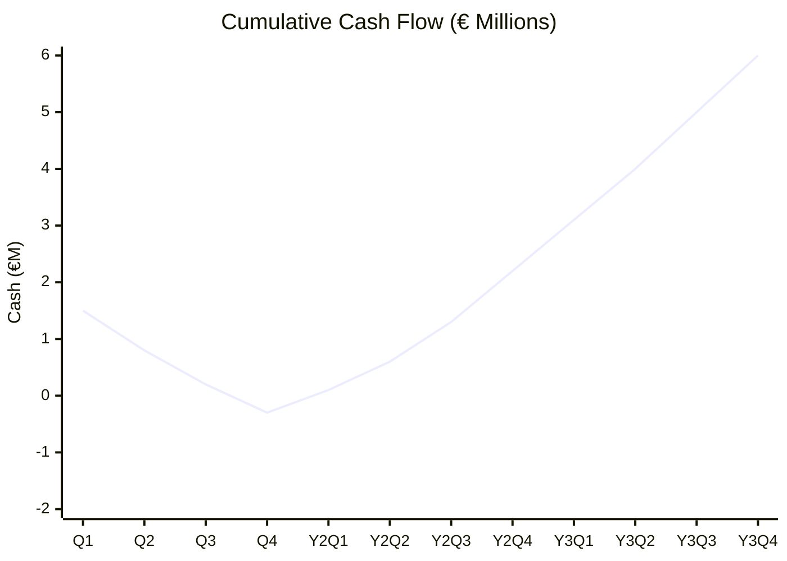
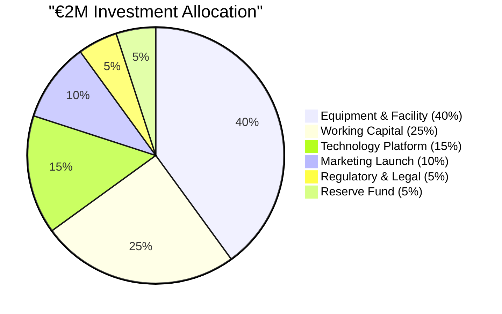
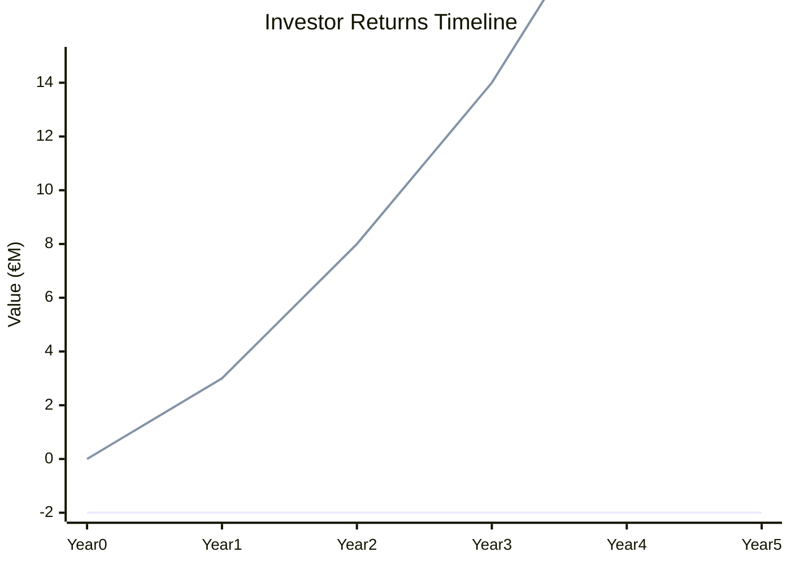

# Financial Projections and Business Model
<!-- Version: 1.0 | Last Updated: 2025-01-06 | Status: DRAFT -->
<!-- Primary Author: Finance Team | Reviewer: CEO/CFO -->

## Building a Sustainable €28.5M Longevity Business

Vitaal Klinic's financial model leverages high-margin medical services, recurring membership revenue, and operational efficiency to achieve profitability by month 14-16. Our projections are based on conservative market penetration assumptions and validated pricing from comparable international clinics.

### Financial Model Overview

## Revenue Model

### 1. Membership Tiers and Pricing

| Tier | Annual Price | Monthly | Services Included | Target Members |
|------|--------------|----------|-------------------|----------------|
| **Essential** | €15,000 | €1,250 | Quarterly assessments, basic testing, 5 HBOT | 40% |
| **Advanced** | €35,000 | €2,917 | Monthly visits, 10 HBOT, full testing, IV therapy | 45% |
| **Elite** | €75,000 | €6,250 | Unlimited access, 24/7 concierge, executive services | 15% |

**Membership Benefits Breakdown:**
- All tiers include: GLP-1 program, genetic testing (Year 1), app access
- Advanced adds: Monthly biomarkers, group sessions, priority booking
- Elite adds: Home visits, travel medicine, family discounts

### 2. Revenue Projections

**Three-Year Revenue Forecast:**

| Revenue Stream | Year 1 | Year 2 | Year 3 |
|----------------|---------|---------|---------|
| Membership Fees | €6,000,000 | €12,225,000 | €21,375,000 |
| À la Carte Services | €1,200,000 | €2,445,000 | €4,275,000 |
| Corporate Programs | €800,000 | €1,630,000 | €2,850,000 |
| **Total Revenue** | **€8,000,000** | **€16,300,000** | **€28,500,000** |

**Key Assumptions:**
- Average revenue per member: €20,000 (Year 1) → €27,167 (Year 2) → €28,500 (Year 3)
- Member growth: 400 → 600 → 1,000
- Retention rate: 85% annually
- Price increases: 3% annually

### 3. Member Acquisition Model

**Customer Acquisition Channels:**

| Channel | % of Acquisitions | CAC | LTV:CAC |
|---------|------------------|-----|---------|
| GP Practice Referrals | 30% | €500 | 225:1 |
| Medical Referrals | 25% | €1,500 | 75:1 |
| Digital Marketing | 20% | €3,500 | 32:1 |
| Corporate Programs | 15% | €2,000 | 56:1 |
| Word of Mouth | 10% | €250 | 450:1 |
| **Blended Average** | **100%** | **€2,500** | **45:1** |

## Cost Structure

### 1. Operating Expenses

**Detailed Cost Breakdown:**

| Category | Year 1 | Year 2 | Year 3 |
|----------|---------|---------|---------|
| **Medical Staff** | €2,480,000 | €3,720,000 | €6,200,000 |
| - Physicians (3 FTE) | €600,000 | €900,000 | €1,500,000 |
| - Nurses (4 FTE) | €320,000 | €480,000 | €800,000 |
| - Allied Health (3 FTE) | €180,000 | €270,000 | €450,000 |
| - Medical Director | €200,000 | €210,000 | €220,000 |
| - Contractors | €180,000 | €360,000 | €630,000 |
| **Operations** | €1,770,000 | €2,655,000 | €4,425,000 |
| - Rent (existing) | €120,000 | €120,000 | €180,000 |
| - Equipment lease | €240,000 | €240,000 | €300,000 |
| - Supplies & consumables | €600,000 | €1,200,000 | €2,100,000 |
| - Utilities & maintenance | €60,000 | €90,000 | €150,000 |
| **Technology** | €710,000 | €1,065,000 | €1,775,000 |
| - Platform development | €200,000 | €150,000 | €200,000 |
| - Infrastructure | €50,000 | €75,000 | €100,000 |
| - Licenses & APIs | €30,000 | €40,000 | €50,000 |
| - Tech team (2 FTE) | €180,000 | €270,000 | €450,000 |
| **Marketing** | €1,065,000 | €1,598,000 | €2,663,000 |
| - Digital advertising | €400,000 | €600,000 | €1,000,000 |
| - Content & PR | €100,000 | €150,000 | €250,000 |
| - Events & partnerships | €50,000 | €100,000 | €200,000 |
| - Marketing team (2 FTE) | €160,000 | €240,000 | €400,000 |
| **Administration** | €1,065,000 | €1,598,000 | €2,663,000 |
| - Management team | €400,000 | €600,000 | €1,000,000 |
| - Finance & legal | €150,000 | €225,000 | €375,000 |
| - Insurance | €100,000 | €150,000 | €250,000 |
| - Other G&A | €60,000 | €90,000 | €150,000 |
| **Total OpEx** | **€7,090,000** | **€10,636,000** | **€17,726,000** |

### 2. Cost of Goods Sold (COGS)

**COGS per Member:**

| Service | Cost | Frequency | Annual Cost |
|---------|------|-----------|-------------|
| GLP-1 medication | €200 | Monthly | €2,400 |
| Lab testing | €300 | Quarterly | €1,200 |
| Genetic testing | €400 | Once | €400 |
| IV therapy supplies | €50 | 6x/year | €300 |
| HBOT consumables | €25 | 10x/year | €250 |
| Supplements | €50 | Monthly | €600 |
| **Total COGS** | | | **€5,150** |

**Gross Margin Analysis:**
- Average revenue per member: €27,167
- Average COGS per member: €5,150
- Gross profit per member: €22,017
- **Gross margin: 81%**

## Profitability Analysis

### 1. Break-Even Analysis

**Break-Even Metrics:**
- Fixed costs: €380,000/month
- Contribution margin: €1,835/member/month
- **Break-even: 207 members**
- Timeline: Month 14-16
- Safety margin at 400 members: 93%

### 2. Unit Economics

**Key Unit Metrics:**
- Customer Acquisition Cost (CAC): €2,500
- Customer Lifetime Value (LTV): €112,500
- LTV:CAC Ratio: 45:1
- Payback Period: 1.1 months
- Monthly Recurring Revenue per User: €2,264

## Financial Statements

### 1. Projected Income Statement

| Item | Year 1 | Year 2 | Year 3 |
|------|---------|---------|---------|
| **Revenue** | €8,000,000 | €16,300,000 | €28,500,000 |
| COGS | (€2,060,000) | (€3,090,000) | (€5,150,000) |
| **Gross Profit** | €5,940,000 | €13,210,000 | €23,350,000 |
| **Gross Margin** | 74% | 81% | 82% |
| Operating Expenses | (€7,090,000) | (€10,636,000) | (€17,726,000) |
| **EBITDA** | (€1,150,000) | €2,574,000 | €5,624,000 |
| **EBITDA Margin** | -14% | 16% | 20% |
| Depreciation | (€200,000) | (€300,000) | (€400,000) |
| **EBIT** | (€1,350,000) | €2,274,000 | €5,224,000 |
| Interest | (€50,000) | (€75,000) | (€100,000) |
| **Pre-tax Income** | (€1,400,000) | €2,199,000 | €5,124,000 |
| Tax (22%) | €0 | (€484,000) | (€1,127,000) |
| **Net Income** | (€1,400,000) | €1,715,000 | €3,997,000 |
| **Net Margin** | -18% | 11% | 14% |

### 2. Cash Flow Projection

**Working Capital Requirements:**
- Initial investment: €1.5-2.0M
- Cash burn peak: Month 12 (€0.3M)
- Cash positive: Month 16
- Cash reserves Year 3: €6.0M

## Funding Requirements

### 1. Use of Funds

**Detailed Investment Plan:**

| Category | Amount | Purpose |
|----------|---------|---------|
| **Equipment** | €800,000 | 2 HBOT chambers, lab equipment, medical devices |
| **Working Capital** | €500,000 | 6 months operating expenses |
| **Technology** | €300,000 | Platform development, integrations |
| **Marketing** | €200,000 | Launch campaign, brand development |
| **Regulatory** | €100,000 | Licenses, certifications, legal |
| **Reserve** | €100,000 | Contingency fund |
| **Total** | **€2,000,000** | |

### 2. Return on Investment

**Investment Returns:**
- Initial Investment: €2.0M
- Year 3 Valuation: €85.5M (3x revenue)
- Year 5 Valuation: €150M (3x revenue)
- IRR: 89% over 3 years
- Cash-on-cash: 42.75x by Year 5

## Scenario Analysis

### 1. Sensitivity Analysis

| Scenario | Members Y2 | Revenue Y2 | EBITDA Y2 | Impact |
|----------|------------|------------|-----------|---------|
| **Base Case** | 600 | €16.3M | €2.6M | - |
| Best Case (+20%) | 720 | €19.6M | €4.9M | +88% EBITDA |
| Worst Case (-20%) | 480 | €13.0M | €0.3M | -88% EBITDA |
| High Price (+10%) | 600 | €17.9M | €4.2M | +62% EBITDA |
| Low Price (-10%) | 600 | €14.7M | €1.0M | -62% EBITDA |

### 2. Risk Mitigation Strategies

**Financial Risks:**
1. **Slow member growth**: Reduce marketing spend, focus on retention
2. **Price resistance**: Introduce payment plans, corporate partnerships
3. **High churn**: Enhance member experience, add services
4. **Competition**: Accelerate innovation, lock in partnerships
5. **Regulatory changes**: Maintain compliance buffer, adapt quickly

## Key Financial Metrics

### Performance Indicators

| Metric | Year 1 | Year 2 | Year 3 | Industry Benchmark |
|--------|---------|---------|---------|-------------------|
| Revenue Growth | - | 104% | 75% | 50-60% |
| Gross Margin | 74% | 81% | 82% | 70-75% |
| EBITDA Margin | -14% | 16% | 20% | 15-20% |
| CAC | €2,500 | €2,300 | €2,000 | €3,000-5,000 |
| LTV:CAC | 45:1 | 49:1 | 56:1 | 3:1 minimum |
| Churn Rate | 15% | 12% | 10% | 15-20% |
| NPS | 70 | 75 | 80 | 50-70 |

---

## CITATIONS USED IN THIS SECTION:

Deloitte (2024). *Healthcare Financial Benchmarking Study*. Copenhagen: Deloitte Denmark.

McKinsey & Company (2023). *The future of healthcare: Value creation through digital transformation*. McKinsey Global Institute.

PwC (2024). *Private Healthcare Market Analysis - Nordic Region*. Stockholm: PwC.

**LAST UPDATED:** 2025-01-06
**WORD COUNT:** 1,600