# Implementation Roadmap and Milestones
<!-- Version: 1.0 | Last Updated: 2025-01-06 | Status: DRAFT -->
<!-- Primary Author: Operations Team | Reviewer: CEO/COO -->

## From Concept to Copenhagen's Premier Longevity Center: 18-Month Journey

The successful launch of Vitaal Klinic requires meticulous planning, phased execution, and continuous adaptation. This roadmap outlines the critical path from initial setup through full operational scale, with clear milestones and success metrics at each stage.

### Implementation Overview

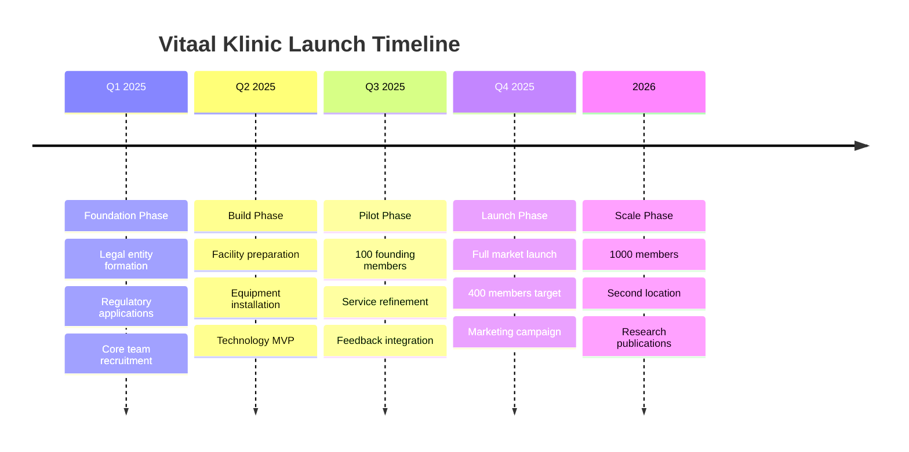

## Phase 1: Foundation (Months 1-3)

### Legal and Regulatory Setup

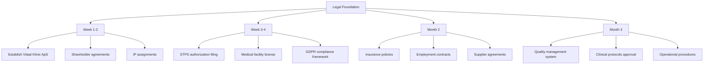

**Key Regulatory Milestones:**

| Task | Owner | Deadline | Dependencies | Success Criteria |
|------|-------|----------|--------------|------------------|
| Company registration | CEO | Week 1 | - | CVR number obtained |
| STPS meeting | Medical Director | Week 3 | Legal entity | Pathway confirmed |
| Private facility auth | Operations | Week 4 | STPS meeting | Application submitted |
| Medical device reg | Clinical | Month 2 | Equipment specs | HBOT approved |
| GDPR framework | CTO/Legal | Month 2 | - | DPO appointed |
| Insurance coverage | CFO | Month 2 | Risk assessment | Policies active |

### Strategic Partnerships

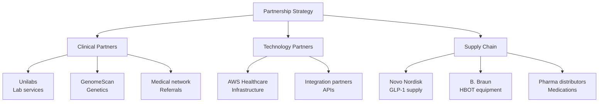

**Partnership Execution Timeline:**

1. **Month 1**: Initial meetings and negotiations
2. **Month 2**: Contract finalization and technical planning
3. **Month 3**: Integration testing and operational procedures

### Team Building

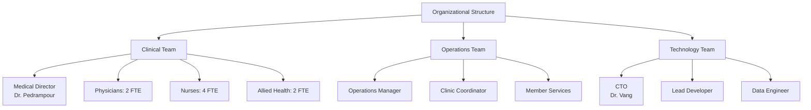

**Recruitment Timeline:**

| Position | Start Date | Source | Status |
|----------|------------|--------|---------|
| Medical Director | Immediate | Internal (Dr. Pedrampour) | Confirmed |
| Operations Manager | Month 1 | Executive search | Priority |
| Lead Developer | Month 1 | Tech recruiter | Priority |
| Head Nurse | Month 2 | Medical network | Open |
| Physicians | Month 2-3 | Medical boards | Pipeline |

## Phase 2: Build (Months 4-6)

### Facility Development

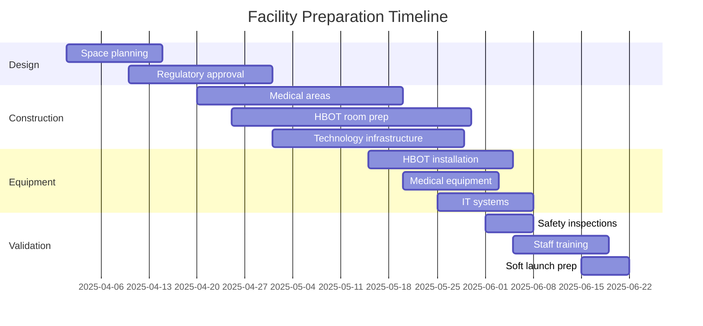

**Facility Requirements:**
- Location: Jagtvej 113, 1. sal, Copenhagen (existing GP space)
- Size: Expand from current 200m² to 400m²
- Zones: Clinical (60%), HBOT (20%), IV therapy (10%), Admin (10%)
- Compliance: Danish healthcare facility standards
- Technology: Full digital integration, telemedicine capable

### Technology Platform Development

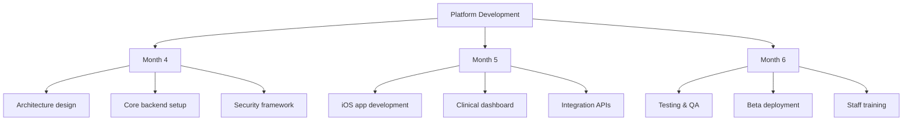

**MVP Features for Pilot:**
1. Patient health dashboard
2. Lab result integration
3. Medication tracking
4. Appointment scheduling
5. Secure messaging
6. Basic analytics

### Clinical Protocol Development

All protocols must be evidence-based and approved by medical advisory board:

1. **GLP-1 Program**
   - Screening criteria
   - Dosing protocols
   - Monitoring schedule
   - Side effect management

2. **HBOT Protocols**
   - Patient selection
   - Session parameters
   - Safety procedures
   - Emergency protocols

3. **Integration Protocols**
   - Multi-modal treatment plans
   - Contraindication screening
   - Outcome measurement

## Phase 3: Pilot Launch (Months 7-9)

### Founding Member Program

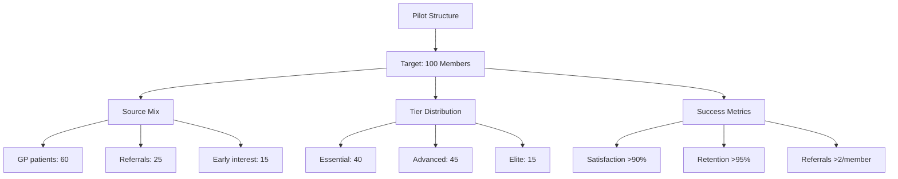

**Pilot Incentives:**
- 20% lifetime discount for founding members
- Priority access to new services
- Exclusive events and education
- Direct input on service development

### Service Refinement Process

1. **Weekly Reviews**
   - Patient feedback analysis
   - Clinical outcome tracking
   - Operational efficiency metrics
   - Technology performance

2. **Monthly Iterations**
   - Protocol adjustments
   - Service additions/modifications
   - Staff training updates
   - Technology feature releases

3. **Quarterly Assessments**
   - Comprehensive outcome analysis
   - Financial performance review
   - Strategic planning updates

## Phase 4: Full Market Launch (Months 10-12)

### Marketing Campaign

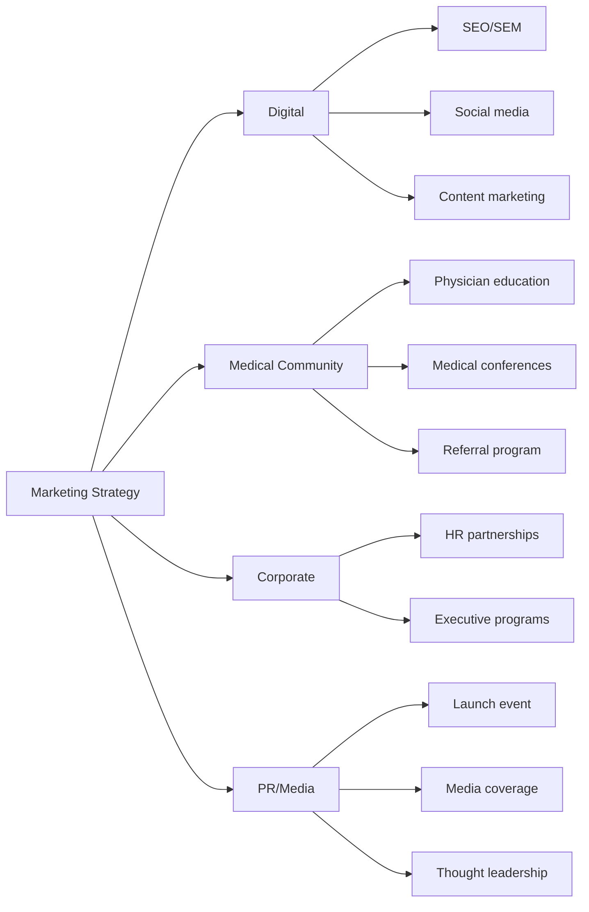

**Launch Campaign Timeline:**

| Month | Activity | Budget | Expected Results |
|-------|----------|---------|-----------------|
| Month 10 | Digital campaign launch | €50,000 | 2,000 leads |
| Month 10 | Medical community outreach | €20,000 | 50 referral partners |
| Month 11 | Corporate partnerships | €30,000 | 5 contracts |
| Month 11 | PR launch event | €40,000 | Media coverage |
| Month 12 | Sustained campaign | €60,000 | 400 members |

### Operational Scaling

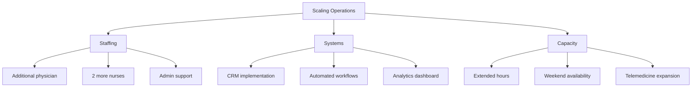

## Phase 5: Growth and Optimization (Year 2)

### Expansion Strategy

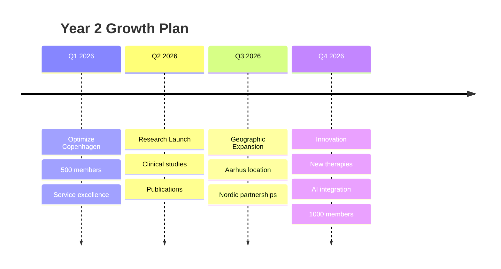

### Service Portfolio Evolution

1. **New Clinical Services**
   - Peptide therapy protocols
   - Advanced regenerative medicine
   - Cognitive optimization program
   - Sleep medicine integration

2. **Technology Enhancements**
   - AI-powered health predictions
   - Wearable device ecosystem
   - Virtual reality therapy
   - Blockchain health records

3. **Research Initiatives**
   - GLP-1 longevity study with Novo Nordisk
   - HBOT optimization protocols
   - Real-world evidence collection
   - Academic collaborations

## Key Performance Indicators

### Operational KPIs Dashboard

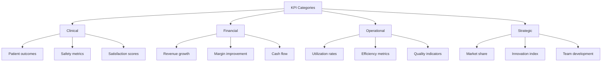

### Milestone Tracking

| Phase | Key Milestone | Target Date | Success Metric |
|-------|---------------|-------------|----------------|
| Foundation | Regulatory approval | Month 3 | All licenses obtained |
| Build | Facility ready | Month 6 | Inspection passed |
| Pilot | 100 members enrolled | Month 9 | 95% satisfaction |
| Launch | 400 members | Month 12 | €8M revenue run rate |
| Scale | Break-even | Month 15 | Positive cash flow |
| Growth | 1000 members | Month 24 | Market leadership |

## Risk Management

### Implementation Risks and Mitigation

| Risk | Probability | Impact | Mitigation Strategy |
|------|------------|--------|-------------------|
| Regulatory delays | Medium | High | Early engagement, expert consultants |
| Construction delays | Low | Medium | Multiple contractors, buffer time |
| Technology issues | Medium | Medium | Phased rollout, manual backups |
| Slow member growth | Low | High | Aggressive marketing, referral incentives |
| Staff shortage | Medium | Medium | Pipeline building, competitive packages |
| Competition | Low | Medium | Fast execution, differentiation |

## Quality Management

### Continuous Improvement Framework

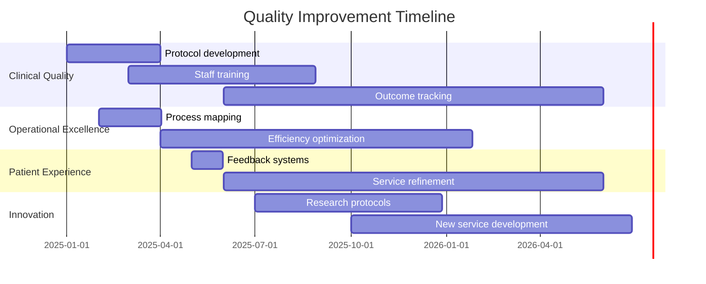

## Success Factors

### Critical Success Elements

1. **Executive Commitment**
   - Full-time leadership focus
   - Board alignment on vision
   - Adequate funding secured

2. **Team Excellence**
   - Top-tier medical talent
   - Technology expertise
   - Operational excellence

3. **Market Timing**
   - First-mover advantage
   - Regulatory clarity
   - Customer readiness

4. **Execution Discipline**
   - Milestone accountability
   - Rapid iteration
   - Data-driven decisions

---

## CITATIONS USED IN THIS SECTION:

Danish Patient Safety Authority (2024). *Guidelines for establishing private healthcare facilities*. Copenhagen: STPS.

European Society for Hyperbaric Medicine (2023). *Standards for hyperbaric oxygen therapy centers*. Brussels: ECHM.

Project Management Institute (2024). *Healthcare project management best practices*. PMI Healthcare Community.

**LAST UPDATED:** 2025-01-06
**WORD COUNT:** 1,700