# Next Steps: Immediate Action Plan
<!-- Version: 1.0 | Last Updated: 2025-01-06 | Status: FINAL -->
<!-- Primary Author: Executive Team | Reviewer: Board -->

## Executive Priority Actions for Q1 2025

The next 90 days are critical for transforming Vitaal Klinic from concept to operational reality. This section provides a detailed action plan with clear ownership, dependencies, and success criteria for immediate execution.

### 30-60-90 Day Sprint Plan

## Week 1-2: Legal and Financial Foundation

### Immediate Actions Required

**Priority Task List:**

| Task | Owner | Deadline | Budget | Status |
|------|-------|----------|---------|---------|
| Company registration (CVR) | CEO | Day 3 | €1,500 | Pending |
| Bank account (Danske Bank) | CFO | Day 5 | €0 | Pending |
| Capital transfer | Investors | Day 7 | €500K | Committed |
| Malpractice insurance | COO | Day 10 | €25K/yr | Quoted |
| GDPR compliance plan | Legal | Day 14 | €5,000 | Started |

**Key Contacts:**
- **Legal Firm**: [Kromann Reumert] - Healthcare specialty
- **Accounting**: [PwC Denmark] - Life sciences division
- **Insurance**: [Willis Towers Watson] - Medical malpractice

## Week 3-4: Regulatory Pathway

### Critical Regulatory Meetings

**Regulatory Meeting Schedule:**

1. **Danish Patient Safety Authority (STPS)**
   - **Contact**: [Name], Senior Advisor
   - **Date**: Week 3
   - **Agenda**: Private facility authorization
   - **Preparation**: Clinical protocols, quality manual
   - **Attendees**: Dr. Pedrampour, CEO, Legal Counsel

2. **Danish Medicines Agency**
   - **Contact**: Medical Device Division
   - **Date**: Week 4
   - **Agenda**: HBOT classification
   - **Documents**: CE certificates, safety data

3. **Data Protection Agency**
   - **Meeting**: Virtual possible
   - **Focus**: Health data handling
   - **Output**: GDPR compliance certification

## Week 5-6: Strategic Partnerships

### Partnership Execution Matrix

**Partnership Action Items:**

| Partner | Next Action | Owner | Date | Critical Path |
|---------|------------|-------|------|---------------|
| Unilabs | Contract signature | Medical Director | Week 5 | Yes |
| GenomeScan | Technical integration plan | CTO | Week 5 | Yes |
| Novo Nordisk | Distribution agreement | CEO | Week 6 | Yes |
| B. Braun | HBOT purchase order | COO | Week 6 | Yes |
| DrugBank | API access setup | CTO | Week 6 | No |

## Week 7-8: Core Team Assembly

### Hiring Sprint Plan

**Recruitment Action Plan:**

1. **Immediate Postings** (Day 1)
   - LinkedIn Premium job posts
   - Læger.dk for physicians
   - Tech: TheHub.dk, Nordic IT jobs
   - Nursing: DSR job board

2. **Interview Schedule** (Week 7-8)
   - First round: Video screening
   - Second round: In-person + case study
   - Final round: Team fit + references
   - Offer: Same week as final

3. **Compensation Packages**
   - Competitive base + equity option
   - Benefits: Health, pension, flex time
   - Signing bonus for critical roles

## Month 2: Infrastructure Development

### Facility and Technology Sprint

**Critical Path Items:**

| Category | Action | Deadline | Dependencies |
|----------|--------|----------|--------------|
| **Facility** | Building permit | Week 6 | Design complete |
| **HBOT** | Purchase order | Week 8 | Financing secured |
| **Technology** | AWS setup | Week 7 | Architecture approved |
| **Clinical** | Protocol approval | Week 10 | Medical board review |

## Month 3: Pre-Launch Excellence

### Launch Readiness Checklist

```mermaid
graph TD
    A[Launch Readiness] --> B[Clinical ✓]
    A --> C[Operational ✓]
    A --> D[Technology ✓]
    A --> E[Marketing ✓]
    
    B --> B1[Protocols approved]
    B --> B2[Staff trained]
    B --> B3[Equipment validated]
    
    C --> C1[Workflows defined]
    C --> C2[Scheduling active]
    C --> C3[Billing ready]
    
    D --> D1[Platform tested]
    D --> D2[Integrations live]
    D --> D3[Security verified]
    
    E --> E1[Website live]
    E --> E2[Campaigns ready]
    E --> E3[PR scheduled]
```

### Pilot Member Recruitment

**Target: 25 Founding Members by Day 90**

1. **Source Strategy**
   - Dr. Pedrampour's patients: 15 members
   - Medical referrals: 5 members
   - Early interest list: 5 members

2. **Incentive Package**
   - 20% lifetime discount
   - Exclusive founding member events
   - Priority access to new services
   - Direct input on development

3. **Onboarding Excellence**
   - Personal welcome call from CEO
   - Comprehensive health assessment
   - Customized treatment plan
   - Dedicated care coordinator

## Critical Success Metrics

### 90-Day KPIs

| Category | Metric | Target | Current | Action Required |
|----------|---------|---------|---------|-----------------|
| **Legal** | Entity formation | Complete | 0% | Immediate |
| **Regulatory** | Applications filed | 100% | 0% | Week 3-4 |
| **Partnerships** | Contracts signed | 5 | 0 | Week 5-6 |
| **Team** | Core positions | 8 | 2 | Week 7-8 |
| **Technology** | MVP complete | 80% | 10% | Month 2-3 |
| **Members** | Pilot enrollment | 25 | 0 | Month 3 |

## Investment and Financial Actions

### Immediate Capital Requirements

```mermaid
pie title "Q1 2025 Capital Deployment (€500K)"
    "Legal & Regulatory" : 50000
    "Team Recruitment" : 100000
    "Technology Development" : 150000
    "Marketing & PR" : 50000
    "Equipment Deposits" : 100000
    "Working Capital" : 50000
```

**Funding Timeline:**
- Week 1: €500K initial capital
- Month 2: €1M equipment financing
- Month 3: €500K additional working capital
- **Total Q1**: €2M deployment

## Board and Stakeholder Communication

### Communication Cadence

**Reporting Structure:**
1. **Weekly**: Progress dashboard to all stakeholders
2. **Bi-weekly**: Board conference call
3. **Monthly**: Comprehensive written report
4. **Quarterly**: In-person board meeting

## Risk Mitigation Priorities

### Top 5 Risks to Address

| Risk | Impact | Mitigation Action | Owner | Deadline |
|------|--------|-------------------|-------|----------|
| Regulatory delay | High | Expert consultant engaged | Medical Director | Week 2 |
| Key hire failure | High | Multiple candidates, search firm | CEO | Week 4 |
| Capital shortfall | Medium | Contingency funding lined up | CFO | Week 3 |
| Technology delay | Medium | Phased approach, vendor backup | CTO | Week 6 |
| Partner issues | Medium | Multiple suppliers identified | COO | Week 5 |

## Call to Action

### Executive Team Actions This Week

**CEO (Jesper Vang):**
- [ ] Finalize entity formation documents
- [ ] Schedule STPS introduction meeting
- [ ] Approve organizational structure
- [ ] Lead investor update call

**Medical Director (Dr. Pedrampour):**
- [ ] Complete clinical protocol drafts
- [ ] Identify physician candidates
- [ ] Plan medical advisory board
- [ ] Review quality framework

**Operations Lead:**
- [ ] Secure insurance quotes
- [ ] Initiate facility planning
- [ ] Map operational workflows
- [ ] Establish vendor contacts

**Technology Lead:**
- [ ] Finalize platform architecture
- [ ] Begin developer recruitment
- [ ] Set up AWS environment
- [ ] Plan integration timeline

## Success Celebration Milestones

Celebrating achievements maintains team momentum:

- 🎯 **Day 7**: Legal entity established
- 🎯 **Day 30**: Regulatory pathway clear
- 🎯 **Day 45**: Core team hired
- 🎯 **Day 60**: Partnerships secured
- 🎯 **Day 75**: Technology MVP ready
- 🎯 **Day 90**: First pilot member enrolled

## Final Message

The opportunity to establish Denmark's premier longevity center is within reach. With Dr. Pedrampour's established practice, Dr. Vang's technical expertise, and a clear market need, Vitaal Klinic is positioned for exceptional success.

**The next 90 days will determine our trajectory. Let's execute with precision, adapt with agility, and build something extraordinary for Danish healthcare.**

### Contact for Immediate Support

**Executive Team:**
- CEO: Dr. Jesper Vang | jesper@vitaalklinic.dk
- Medical Director: Dr. Peyman Pedrampour | peyman@vitaalklinic.dk
- Location: Jagtvej 113, 1. sal, 2200 Copenhagen N

**Time to transform vision into reality. Let's begin.**

---

## CITATIONS USED IN THIS SECTION:

Danish Medical Association (2024). *Guidelines for private practice establishment*. Copenhagen: Lægeforeningen.

Startup Denmark (2024). *Healthcare startup regulatory guide*. Copenhagen: Ministry of Business.

**LAST UPDATED:** 2025-01-06
**WORD COUNT:** 1,500