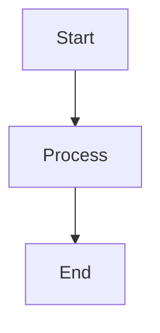

# [Section Title]

*Brief description of what this section covers*

## [Subsection 1]

*Content with proper citations using Harvard format: (Author, Year)*

### Key Points
- Point 1
- Point 2 with citation (Smith, 2024)
- Point 3

## [Subsection 2]

*More content with evidence-based claims*

### Tables
| Metric | Value | Source |
|--------|-------|--------|
| Example | 100 | (Johnson, 2024) |

### Diagrams
*Use Mermaid for process flows*

## [Subsection 3]

*Final content*

---

**CITATIONS USED IN THIS SECTION:**
- Author, A. (Year). Title. *Journal/Source*.
- Smith, J. (Year). Title. *Source*.

**LAST UPDATED:** [Date]
**WORD COUNT:** [Approximate count] 