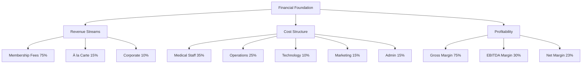

# Example: Mermaid to D2 Conversion

## Original Mermaid (from Financial Projections)


## Enhanced D2 Version
```d2
# Financial Model Architecture
direction: right

title: "Financial Model Architecture" {
  shape: text
  style.font-size: 24
  style.bold: true
  style.font-color: "#0B4F71"
  near: top-center
}

# Main foundation with icon
foundation: "Financial Foundation" {
  shape: hexagon
  style: {
    fill: "#0B4F71"
    stroke: "#0B4F71"
    font-color: "white"
    font-size: 18
    bold: true
    shadow: true
  }
}

# Revenue section with visual hierarchy
revenue: "Revenue Streams" {
  shape: rectangle
  style: {
    fill: "#4FB06D"
    stroke: "#4FB06D"
    font-color: "white"
    font-size: 16
    border-radius: 12
  }
  
  grid-rows: 3
  
  membership: "Membership Fees\n75% • €21.4M" {
    style: {
      fill: "#5FCA7D"
      font-size: 14
      bold: true
    }
  }
  
  alacarte: "À la Carte\n15% • €4.3M" {
    style: {
      fill: "#6FD58D"
      font-size: 14
    }
  }
  
  corporate: "Corporate\n10% • €2.9M" {
    style: {
      fill: "#7FE09D"
      font-size: 14
    }
  }
}

# Cost structure with icons
costs: "Cost Structure" {
  shape: rectangle
  style: {
    fill: "#F39C12"
    stroke: "#F39C12"
    font-color: "white"
    font-size: 16
    border-radius: 12
  }
  
  grid-columns: 3
  grid-rows: 2
  
  staff: "Medical Staff\n35%" { style.fill: "#F4A932" }
  ops: "Operations\n25%" { style.fill: "#F5B142" }
  tech: "Technology\n10%" { style.fill: "#F6B952" }
  marketing: "Marketing\n15%" { style.fill: "#F7C162" }
  admin: "Admin\n15%" { style.fill: "#F8C972" }
}

# Profitability metrics as gauges
profit: "Profitability" {
  shape: rectangle
  style: {
    fill: "#E74C3C"
    stroke: "#E74C3C"
    font-color: "white"
    font-size: 16
    border-radius: 12
  }
  
  grid-rows: 3
  
  gross: "Gross Margin\n78%" {
    shape: circle
    style: {
      fill: "#EC7063"
      font-size: 14
      bold: true
    }
  }
  
  ebitda: "EBITDA Margin\n33%" {
    shape: circle
    style: {
      fill: "#F1948A"
      font-size: 14
    }
  }
  
  net: "Net Margin\n23%" {
    shape: circle
    style: {
      fill: "#FADBD8"
      font-color: "#E74C3C"
      font-size: 14
    }
  }
}

# Enhanced connections
foundation -> revenue: {
  style: {
    stroke: "#4FB06D"
    stroke-width: 3
    filled: true
  }
  label: "€28.5M"
}

foundation -> costs: {
  style: {
    stroke: "#F39C12"
    stroke-width: 3
    filled: true
  }
  label: "€19.1M"
}

foundation -> profit: {
  style: {
    stroke: "#E74C3C"
    stroke-width: 3
    filled: true
  }
  label: "€9.4M"
}
```

## Key Improvements in D2:

1. **Visual Hierarchy**: Hexagon for main node, rectangles for categories, circles for metrics
2. **Grid Layouts**: Organized sub-elements in grids for better structure
3. **Color Gradients**: Subtle variations within categories
4. **Data Labels**: Actual values included with percentages
5. **Enhanced Connections**: Labeled arrows with financial flows
6. **Professional Typography**: Multiple font sizes and weights
7. **Drop Shadows**: Added depth to primary elements
8. **Consistent Branding**: Vitaal colors throughout

The D2 version provides a more professional, informative, and visually appealing diagram compared to the basic Mermaid version.
